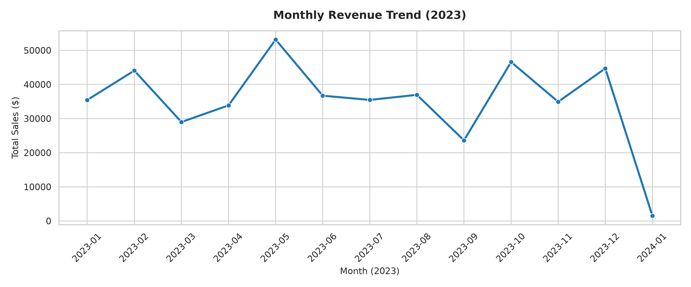
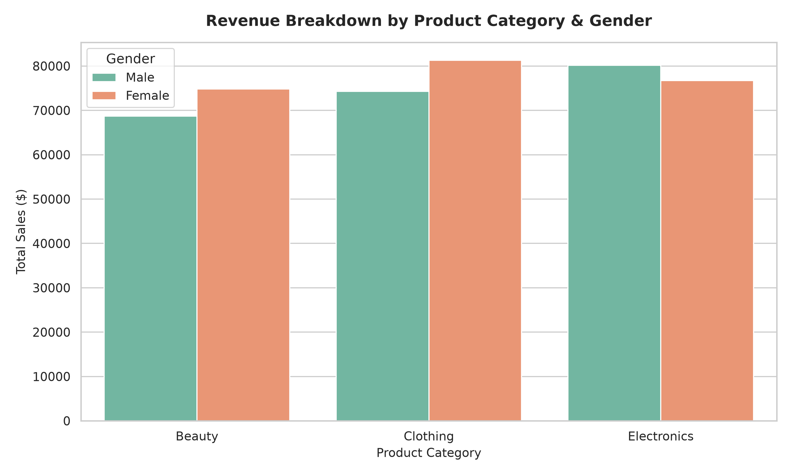
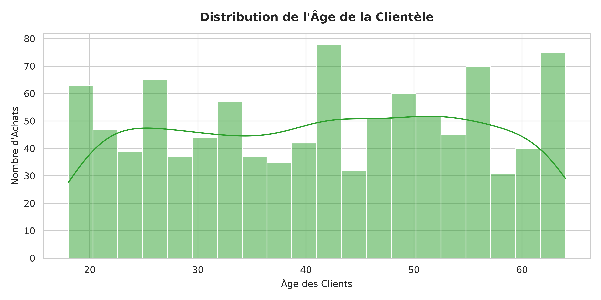

# Retail Sales E-Commerce Data Analysis

This project features an exploratory data analysis (EDA) of a retail sales dataset (`retail_sales_dataset.csv`). The main objective is to uncover purchasing trends, extract customer demographic profiles, and identify the top-performing product categories.

## Tech Stack
* **Python 3**
* **Pandas** & **NumPy** (Data cleaning and manipulation)
* **Matplotlib** & **Seaborn** (Data visualization)

## Key Visualizations

### 1. Monthly Revenue Trend
This chart tracks the overall sales performance month-by-month throughout the year to identify potential seasonal peaks or drops.

### 2. Revenue by Product Category & Gender
A comparative breakdown to understand which product categories (Beauty, Clothing, Electronics) generate the highest revenue based on the customer's gender.

### 3. Customer Age Distribution
A visualization of our buyer demographics (using a histogram and KDE line) to better understand our core target audience for future marketing campaigns.

## Key Insights
* **Seasonality:** Sales peaked during specific months, suggesting a strong seasonal or holiday impact on consumer behavior.
* **Demographics:** The customer base shows a highly uniform age distribution, indicating that our products appeal equally to multiple age brackets.
* **Top Categories:** Electronics and Clothing remain major drivers of total revenue, with minor spending differences across genders.
